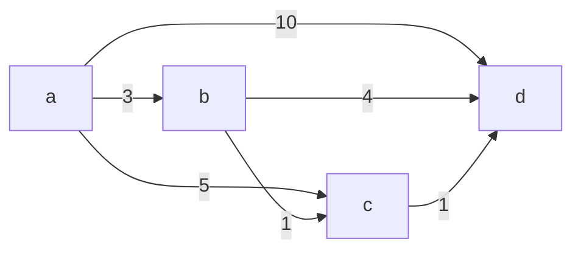
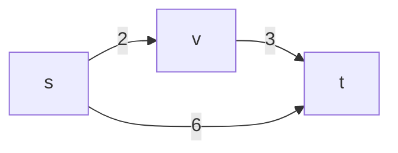

# VCG Shortest Path Payments

This project demonstrates how to compute the shortest path and VCG payments for each edge in the path using NetworkX.

## Example 1: Undirected Graph

### Graph



### Code

```python
G1 = nx.Graph()
G1.add_edge("a", "b", weight=3)
G1.add_edge("a", "c", weight=5)
G1.add_edge("a", "d", weight=10)
G1.add_edge("b", "c", weight=1)
G1.add_edge("b", "d", weight=4)
G1.add_edge("c", "d", weight=1)
path, cost, payments = vcg_cheapest_path(G1, "a", "d")
```

### Output

```
Shortest path: ['a', 'b', 'c', 'd']
Total cost:    5
Payments:
  ('a', 'b') pay: 4
  ('b', 'c') pay: 2
  ('c', 'd') pay: 3
For the rest of the edges, e pay 0
Total payments: 9
```

---

## Example 2: Directed Graph

### Graph



### Code

```python
G2 = nx.DiGraph()
G2.add_edge("s", "v", weight=2)
G2.add_edge("v", "t", weight=3)
G2.add_edge("s", "t", weight=6)
path, cost, pay = vcg_cheapest_path(G2, "s", "t")
```

### Output

```
Shortest path: ['s', 'v', 't']
Total cost:    5
Payments:
  ('s', 'v') pay: 3
  ('v', 't') pay: 4
For the rest of the edges, e pay 0
Total payments: 7
```

---
